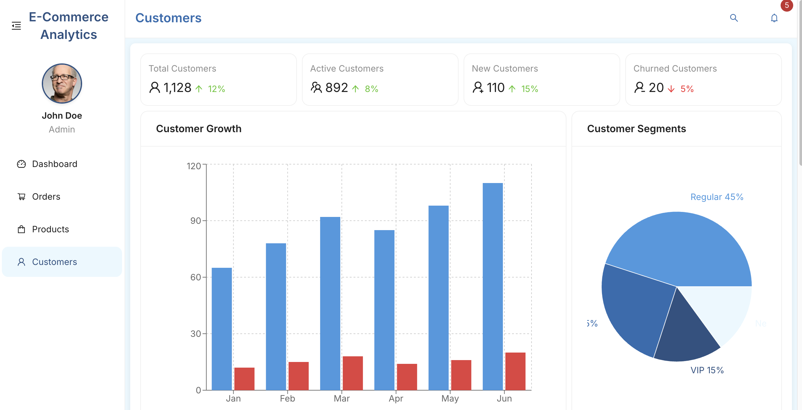

# E-commerce Dashboard

The E-commerce Dashboard is a web application built with React and TypeScript, using Vite for development. It provides a comprehensive interface for managing various aspects of an e-commerce business.

## Features
- **Dashboard**: A central hub for viewing key metrics and insights.
- **Products Management**: Interface for managing product listings.
- **Orders Management**: Tools for tracking and managing customer orders.
- **Analytics**: Visualizations and reports on sales and customer data.
- **Customers Management**: Manage customer information and interactions.

## Tech Stack
- **Frontend**: React, TypeScript, React Router, Ant Design for UI components.
- **State Management**: Redux (assumed from the project description).
- **Build Tool**: Vite.

## Installation Instructions
1. Clone the repository.
2. Install dependencies using `npm install`.
3. Start the development server with `npm run dev`.

## Usage
- Access the application at `http://localhost:3000` after starting the development server.
- Navigate through the dashboard, products, orders, analytics, and customers sections using the provided routes.

## Contributing
- Fork the repository and create a new branch for your feature or bug fix.
- Submit a pull request for review.

